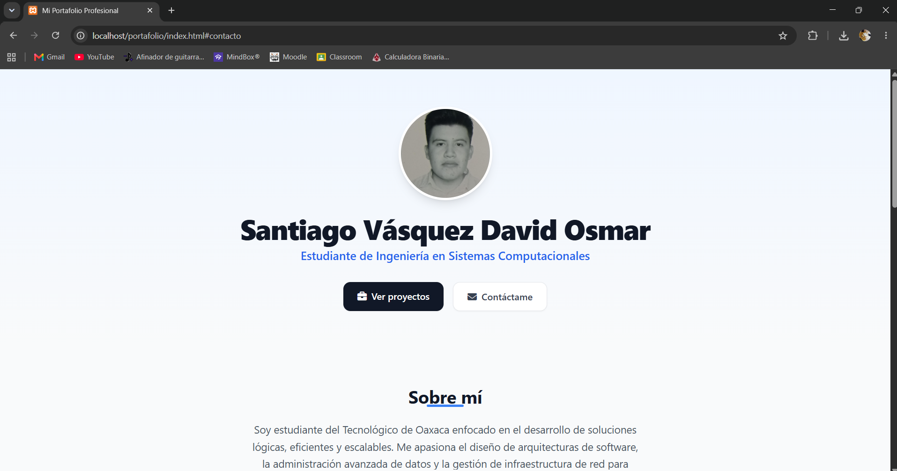
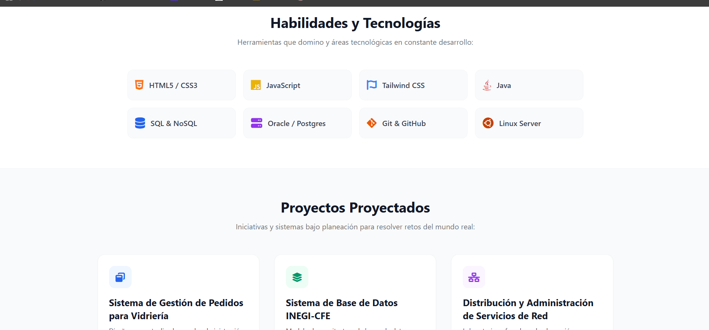

# Portada
## Datos del Alumno
* **Nombre:** David Osmar Santiago Vásquez
* **Materia:** Programación Web
* **Docente:** Martinez Nieto Adelina

---

## 📖 Descripción del Proyecto

### 🛠️ Framework CSS Utilizado
Para el diseño de este portafolio se seleccionó **Tailwind CSS**. A diferencia de otros frameworks tradicionales que imponen componentes rígidos, Tailwind CSS nos permite trabajar con un enfoque de utilidades en capas puras. Esto garantiza un control absoluto sobre el espaciado, la tipografía y la interactividad visual de cada tarjeta de forma modular, manteniendo un rendimiento impecable del lado del cliente.

### 🌐 Estructura y Secciones del Portafolio
El portafolio se de:

1. **Presentación Principal:** Zona de impacto inicial que cuenta con un degradado sutil (`bg-gradient-to-b`). Despliega de forma centralizada el nombre completo, el título profesional enfocado en la ingeniería de sistemas, accesos rápidos interactivos a los proyectos e información de contacto, y un contenedor optimizado mediante scripts para la fotografía formal del estudiante.
2. **Sobre Mí:** Breve resumen descriptivo enfocado al perfil técnico del alumno en el Tecnológico de Oaxaca, comunicando de inmediato la pasión por las arquitecturas lógicas, administración de datos y la resolución de problemas reales.
3. **Habilidades y Tecnologías:** Matriz de competencias estructurada en cuadrícula adaptable (`grid`). Muestra de forma iconográfica tecnologías clave dominadas y en desarrollo continuo como **HTML5/CSS3, JavaScript, Tailwind CSS, Java, SQL/NoSQL (Oracle/PostgreSQL), Git/GitHub y Linux Ubuntu Server**.
4. **Proyectos Proyectados:** Módulos de tarjetas (`project-card`) diseñadas con animaciones flotantes que exponen iniciativas de alto valor técnico:
   * *Sistema de Gestión para Vidriería:* Administración de inventarios y cotizaciones dinámicas.
   * *Sistema de Base de Datos INEGI-CFE:* Correlación estadística y análisis masivo de datos mediante arquitecturas relacionales en Oracle 19c.
   * *Distribución de Servicios de Red:* Simulación y despliegue centralizado de protocolos esenciales (SSH, HTTP, DNS, DHCP, FTP) en servidores Ubuntu.
5. **Contacto:** Pie de página funcional (`footer`) oscuro de alto contraste que aloja los canales directos de comunicación (teléfono y correo institucional).

### 📥 Enlace de Plantilla y Recursos Base
El diseño estructural toma como base los lineamientos minimalistas y de espaciado limpio propuestos en los patrones abiertos de componentes de:
* **Tailwind CSS Components Docs:** [https://tailwindcss.com](https://tailwindcss.com)
* **FontAwesome Icon Pack (CDN):** [https://cdnjs.com/libraries/font-awesome](https://cdnjs.com/libraries/font-awesome)
* **Plantilla de diseño:** 
* **Diseño de portafolio:**<link rel="stylesheet" href="css/portafolio.css">

---

## 🛠️ Proceso de Creación (Paso a Paso)

El portafolio se estructuró desde cero aplicando las mejores prácticas de la ingeniería web, dividiendo de manera estricta la **estructura (HTML5)**, el **estilo (CSS3 personalizado)** y la **lógica de comportamiento (JavaScript)** en archivos independientes.

### Paso 1: Configuración del Espacio de Trabajo y Arquitectura Modular
Se generó un directorio local limpio con tres archivos raíz independientes (`index.html`, `styles.css`, `script.js`) para evitar el acoplamiento de código y facilitar el mantenimiento futuro de la aplicación web.

### Paso 2: Construcción de la Estructura Semántica (HTML5)
Se codificó la estructura base utilizando etiquetas semánticas estrictas (`<header>`, `<section>`, `<footer>`). Esto mejora drásticamente la accesibilidad y el posicionamiento SEO. En este paso se vincularon las dependencias externas a través de enlaces CDN seguros (Tailwind CSS y FontAwesome para la paquetería de iconos lógicos).

### Paso 3: Separación y Refinamiento del Diseño (CSS3 Personalizado)
Aunque Tailwind CSS resuelve la mayor parte de los estilos directamente en las clases de las etiquetas, se decidió **crear un archivo `styles.css` dedicado**. 
* **Por qué se hizo:** Para inyectar comportamiento de diseño puro que Tailwind no maneja por defecto de manera nativa sin configuraciones complejas, tales como el suavizado de scroll global (`scroll-behavior: smooth`), animaciones de entrada controladas por fotogramas (`@keyframes fadeIn`), e interacciones dinámicas de elevación en el eje Z (`transform: translateY`) para las tarjetas al posicionar el cursor sobre ellas.

### Paso 4: Implementación de la Lógica de Respaldo y Robustez (JavaScript)
Se programó el archivo `script.js` con una mentalidad de tolerancia a fallos enfocada en la experiencia de usuario.
* **Por qué se hizo:** El portafolio requiere una foto formal del estudiante. Si por algún motivo el archivo local de la imagen (`tu-foto-formal.jpg`) llega a corromperse, no se encuentra en el directorio o se escribe mal la extensión, el código de JavaScript intercepta el evento de error de carga de forma inmediata. Automáticamente oculta la etiqueta rota y activa una clase contenedora para renderizar un icono de usuario vectorizado elegante. Esto evita que la interfaz del portafolio se visualice "rota" o con fallos ante un evaluador o reclutador.

### Paso 5: Despliegue y Pruebas Locales
Se realizaron auditorías de renderizado en diferentes dimensiones de pantalla (móviles, tabletas y ordenadores de escritorio), comprobando que las clases utilitarias de Tailwind respondieran de forma responsiva y que la navegación mediante enlaces de anclaje funcionara con total fluidez.

---

## Capturas de Pantalla

